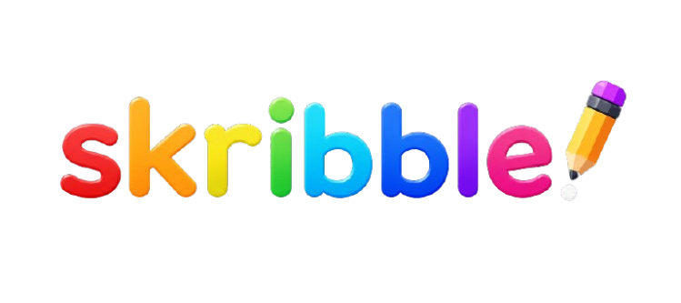
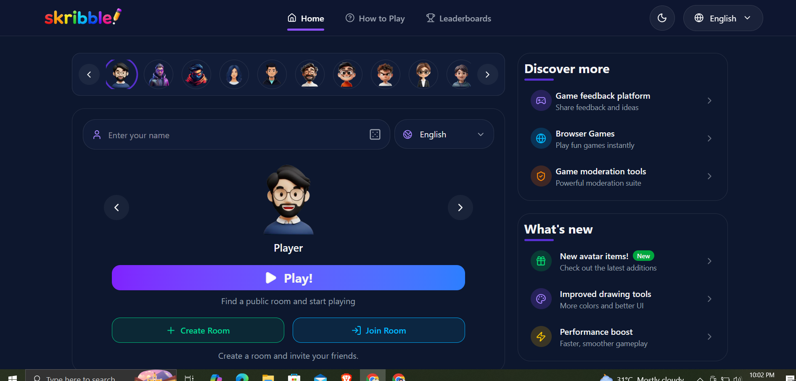
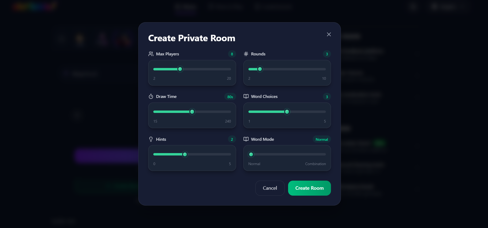
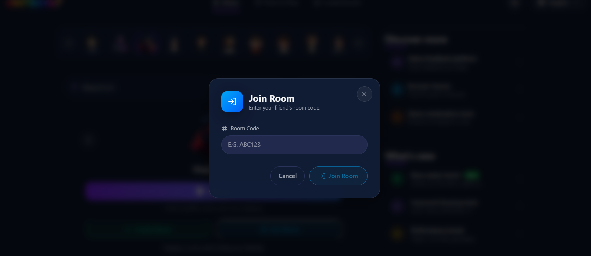
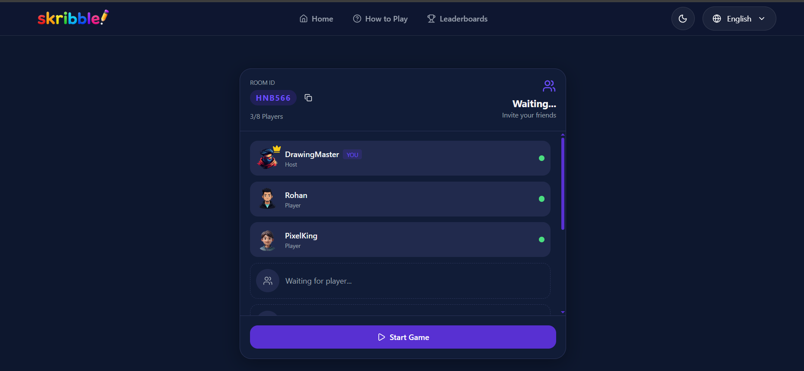
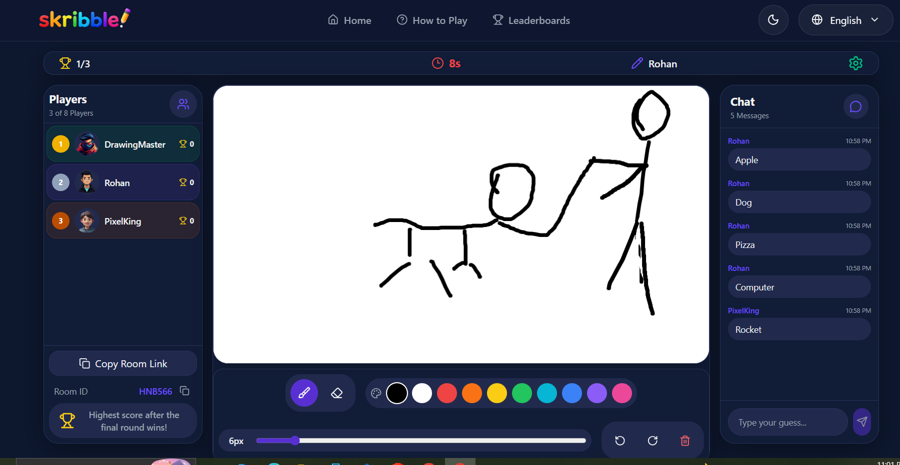
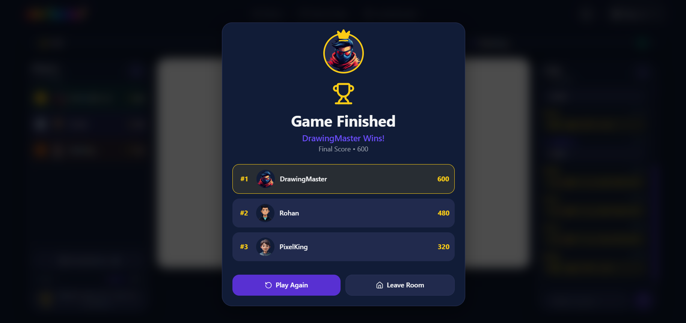

<p align="center">
  
</p>

<h1 align="center">🎨 Skribbl Clone</h1>

<p align="center">
A real-time multiplayer drawing and guessing game inspired by Skribbl.io, built with Next.js, Node.js, Socket.IO, MongoDB and TypeScript.
</p>

<p align="center">


</p>

---

<p align="center">
  <a href="https://skribble-clone-eight.vercel.app/" target="_blank">
    
  </a>
</p>

<p align="center">
  <strong>🌐 https://skribble-clone-eight.vercel.app/</strong>
</p>
# ✨ Features

- 🎮 Real-time Multiplayer Rooms
- 🎨 Smooth Canvas Drawing
- ⚡ Instant Socket.IO Synchronization
- 💬 Live Chat & Guessing
- 🎯 Dynamic Score System
- 🎲 Random Word Selection
- ⏱️ Round Timer & Countdown
- 👥 Public & Private Rooms
- 🎭 Avatar Selection
- 🌍 Multi-language Support
- 📱 Responsive UI
- 🏆 Final Leaderboard

---

# 🛠 Tech Stack

| Frontend      | Backend   | Database |
| ------------- | --------- | -------- |
| Next.js       | Node.js   | MongoDB  |
| React         | Express   | Mongoose |
| TypeScript    | Socket.IO |          |
| Redux Toolkit |           |          |
| Tailwind CSS  |           |          |

---

# 📸 Application Preview

## 🏠 Home

<p align="center">

</p>

---

## ➕ Create Room

<p align="center">

</p>

---

## 🚪 Join Room

<p align="center">

</p>

---

## 👥 Waiting Room

<p align="center">

</p>

---

## 🎨 Gameplay

<p align="center">

</p>

---

## 🏆 Game Over & Leaderboard

<p align="center">

</p>

---

# 🚀 Getting Started

## Clone Repository

```bash
git clone https://github.com/mohdsohrab2003/Skribble-Clone.git

cd Skribble-Clone
```

## Backend

```bash
cd server

npm install

npm run dev
```

Runs on

```
http://localhost:4000
```

## Frontend

```bash
cd client

npm install

npm run dev
```

Runs on

```
http://localhost:3000
```

---

# 🎮 Game Flow

```text
Home
   │
   ▼
Create Room
   │
   ▼
Players Join
   │
   ▼
Waiting Room
   │
   ▼
Game Starts
   │
   ▼
Choose Word
   │
   ▼
Draw
   │
   ▼
Guess
   │
   ▼
Round Complete
   │
   ▼
Next Player
   │
   ▼
Leaderboard
   │
   ▼
Game Finished
```

---

# 📂 Project Structure

```
Skribble-Clone
│
├── client
│   ├── src
│   ├── public
│   └── package.json
│
├── server
│   ├── src
│   └── package.json
│
└── README.md
```

---

# 👨‍💻 Author

## Mohammed Sohrab

Full Stack Developer

⭐ If you found this project helpful, please give it a star.
